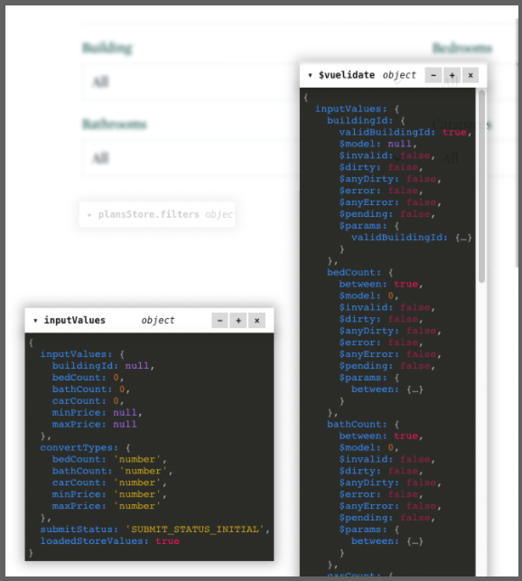

# Smart Hovering Inline Debugger (shid)

A little package that renders multiple windows inside your website or app for containing
syntax-highlighted JSON or buttons to control the app.



## Features

- Easy to integrate into project
- Drag windows around the screen
- Location and other settings for each window are remembered via localStorage
- Syntax highlighting
- Works on iPad and all browsers
- Not many dependancies (As of writing this, has none)
- Can "minimize" a wondow which then fades away like a ghost so it isn't intrusive
- Adjust nested object depth
- 2 color themes, light and dark
- Adjust json formatting like single or double quotes, indentation, and object key quotes on or off

## Setup

### Stand-alone

```sh
npm install shid
```

### React

```sh
npm install react-shid
```

### Vue

```sh
npm install vue-shid
```

### Other

Feel free to add one for a different js framework, or leave a ticket with your ideas.

## Reason/Goal and inspiration

I got sick of using the dev tools for Vue and React in a different window. So this just shoves it
inside the current one.
Kinda like the [stats](https://github.com/mrdoob/stats.js/) library.

It should be as user-friendly and controlable as possible for a developer. It should also be hard
for it to accidentally appear in production, as it could leave your app vulnerable or just cover the
screen with crazy colorful boxes.
